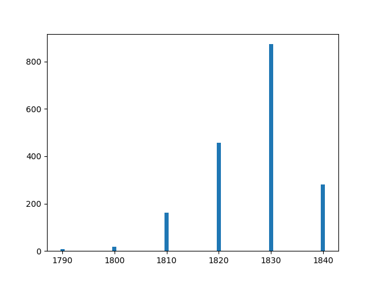
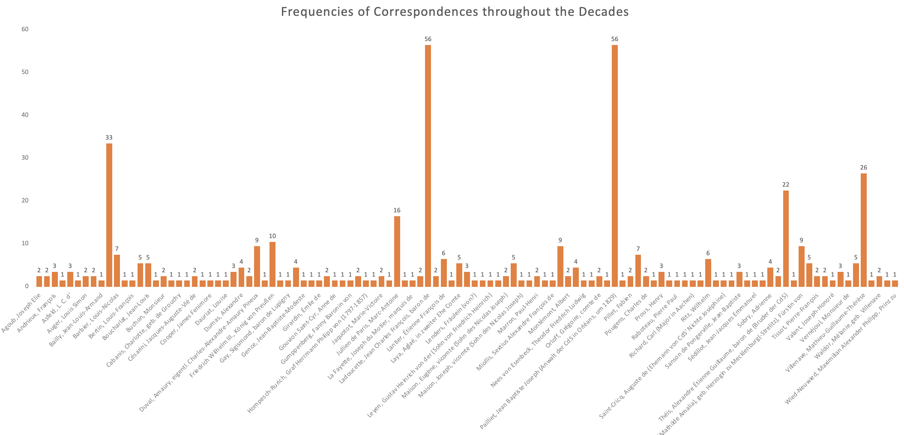
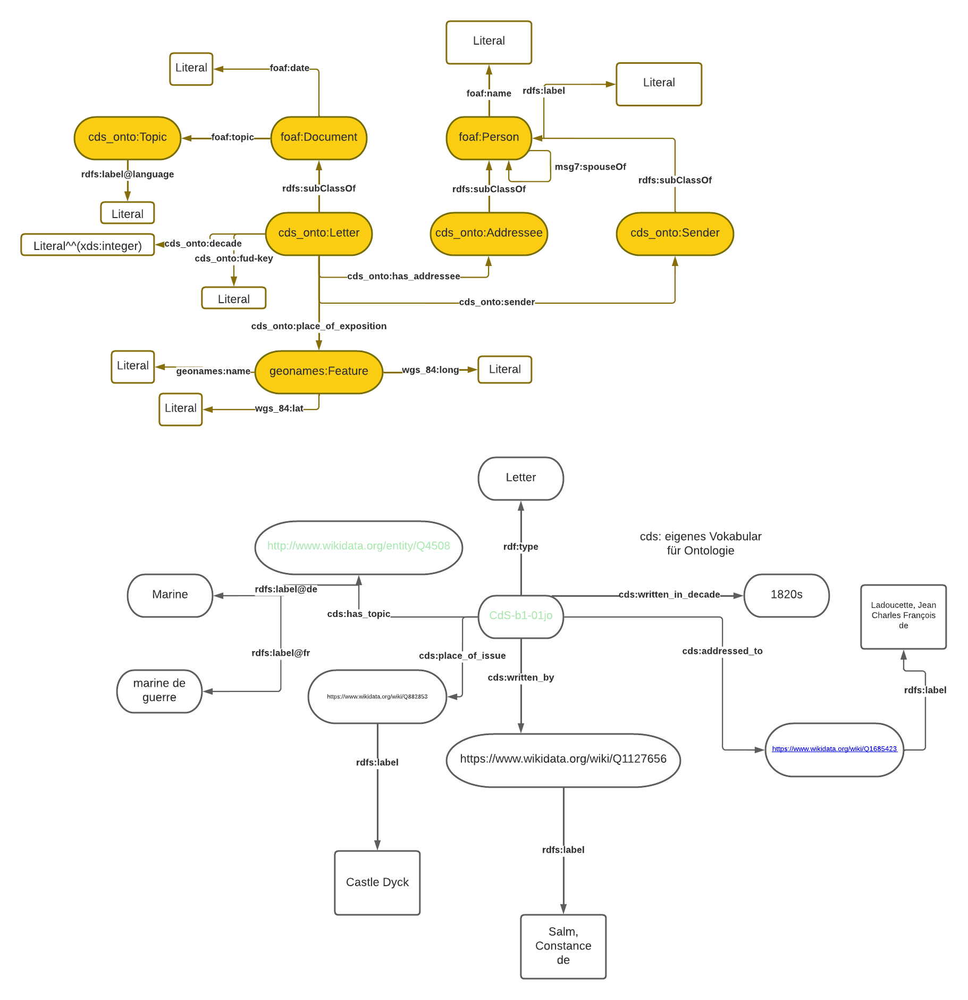
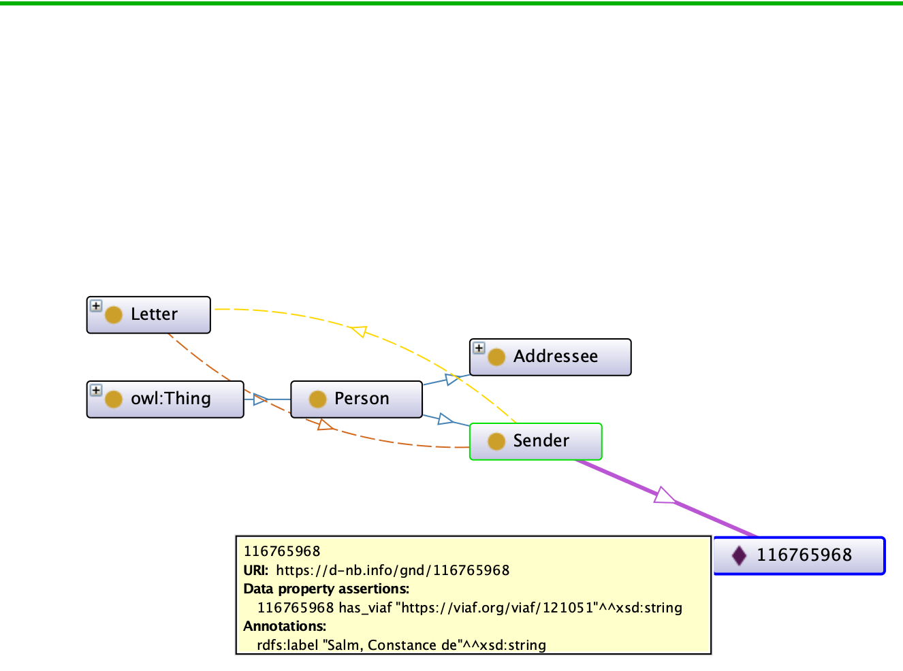
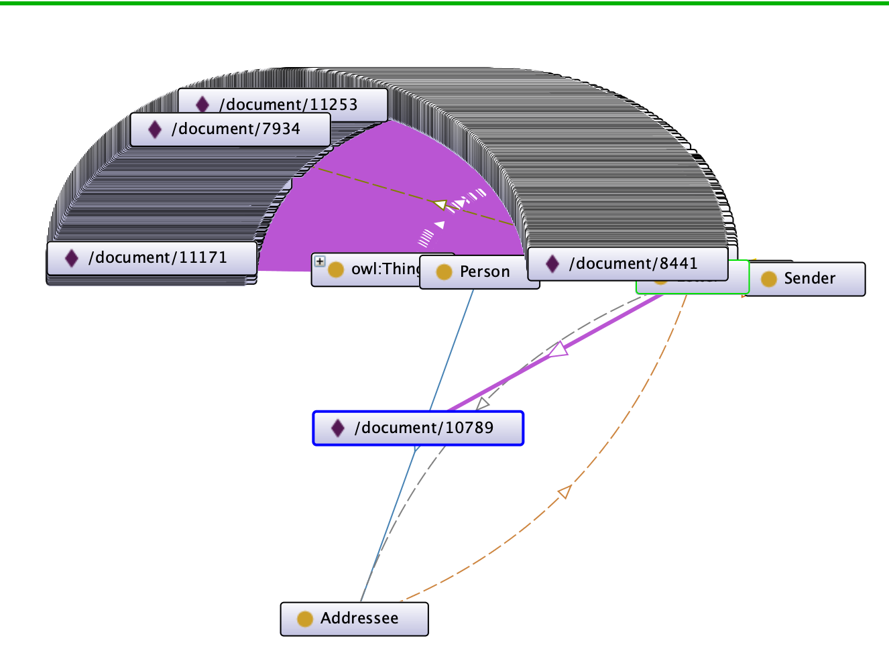
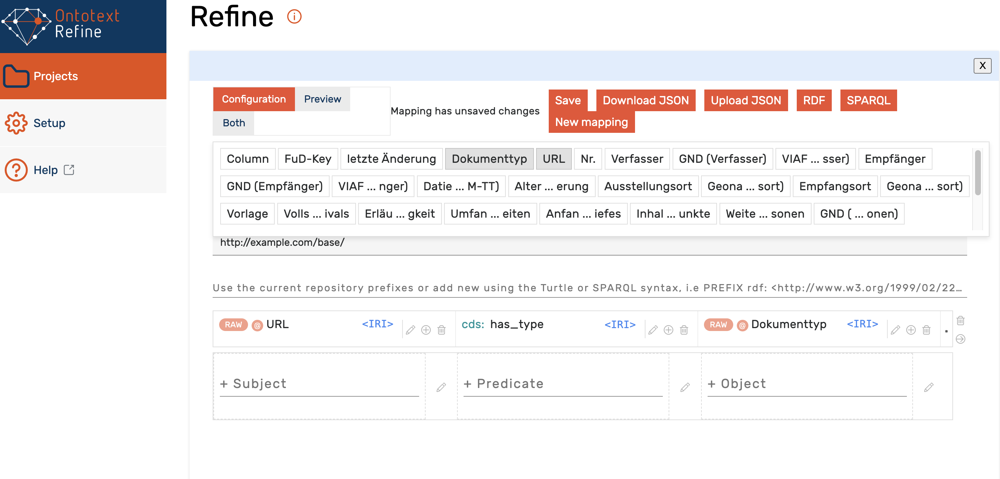
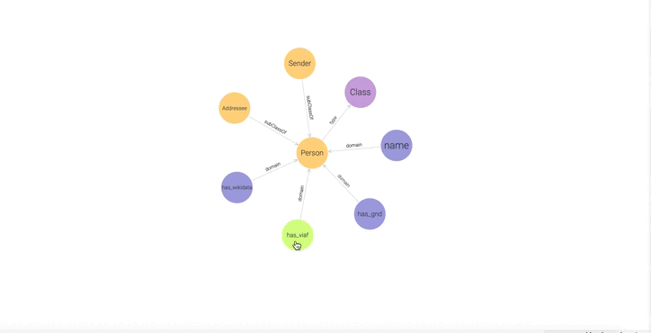

# Repository of code and data created during my internship at the IHA/DHI Paris
## Introduction
This repository is a collection of all scripts used for (pre-)processing and visualising the data from the
Constance de Salm correspondence. It also includes the original data (CSV file) that was used plus almost 
all visualisations as demonstrative PNG or GIFs.

## Histograms of Correspondence Frequencies
Some visualisations that are included are histograms of correspondences throughout the decades. In lieu
of visualising them in Python, further steps were taken in Excel for better team-intern accessibility, readability
and reusability. The script mainly provides tools for filtering the data basis for Excel.

This is a first try of visualising the correspondence frequencies (y-axis) throughout the decades (x-axis)
using [matplotlib](https://matplotlib.org/). Given the fact that the visualisation did not quite fit
the initial expectations plus the rather complicate handling, I decided to only use Python in this step to retrieve
the filtered data from the CSV and import it into Excel.

As can be seen in this visualisation, in Excel, I was able to filter the frequencies not only by decades but also by
the people with whom Constance de Salm corresponded. The visualisation is interactive due to Excel's integrated filtering tool
and can be read modified even without further technological expertise.
## Network of Constance de Salm's Correspondence
Firstly, I wanted to create a network that allows a user to interact with it and that has filters that can be modified
and applied to the data. Pre-existing tool like Gephi or Cytoscape both do not include filtering techniques for graph data
so instead I chose to use a Python and Javascript framework to create a virtual server on which a HTML page is launched
that can be used by other people to explore the graph data.
The interactive network was created using the modules [Networkx](https://networkx.org/), [Plotly](https://plotly.com/python/) and [Dash](https://dash.plotly.com/).
Moreover, the script was inspired by the following Medium [article](https://towardsdatascience.com/python-interactive-network-visualization-using-networkx-plotly-and-dash-e44749161ed7)
and adjusted to my needs.  
 
Further information will be added following the example of Semantic Web graphs.
## Enriching the Network with Semantic Information
To visualise a correspondence – an already existing corpus of connections between people who communicated with each other –
in an ontology, can come with many advantages. Not only do Linked (Open) Data standards like RDF make data more [findable, accessible, interoperable
and reusable](https://www.go-fair.org/fair-principles/); they can also bring it into a new context. 

>This is how the RDF model triples the power of any given data piece by giving it the means
to enter endless relationships with other data pieces and become the building block of 
greater, more flexible and richly interconnected data structures.   
> [See: Ontotext – What is RDF?](https://www.ontotext.com/knowledgehub/fundamentals/what-is-rdf/)

Thereby, pre-existing statements, for example those about exchanged
letters of Constance de Salm, can be perceived from a new perspective. More information about people, their relationships,
the places of expositions or the keywords used in the letters can be added.

> Being a powerful and expressive framework for representing data, RDF is used for building knowledge graphs –
> richly interlinked, interoperable and flexible information structures.  
> [See: Ontotext – The RDF Knowledge Graph](https://www.ontotext.com/knowledgehub/fundamentals/what-is-rdf/)

### *First steps – Ontologies and Knowledge Graphs*
The first step of transforming this data basis into an ontology and then a knowledge graph is to find and/or create a model
that fits the data and represents the wanted information.  
In the Semantic Web, one of the main goals is the enrichment of data collections with "richer" information, meaning to enhance its expressiveness. Semantics or ``knowledge`` make such 
bases not only more accessible to humans but also more interoperable on the web.
> The Semantic Web is an extension of the current Web that will allow you to find, share, and combine information more easily.  
> [See: W3C – Goals / Objectives](https://www.w3.org/2003/Talks/0522-swa-em/slide3-0.html)

Thinking of a model can be hard: What do I want my model to express?  
Hence, it can be useful to model some examples by hand, like I did in the following screenshot:

Here, I tried to model what I want the CdS ontology to look like. Implementing a simple, basic model in [Lucidchart](https://www.lucidchart.com/) provided me with a first idea of
what statements might be in the graph and what datatypes could be necessary. An ontology, other than a knowledge graph,
models more abstractly, setting relationships between classes, domains and ranges of properties or datatype rules.
> More
specifically, in ontology, we have categories, properties and relationships
between the concepts, data and entities. Similarly, in Knowledge Graphs, we
have subgraphs, properties, relationships, data and vertices (nodes). However,
there is a fundamental dierence between them. A Knowledge Graph is a
representation of knowledge in a graph form, which very often derives from a
graph database (GDB) - a database that stores data by using a graph
architecture. A Knowledge Graph and its database structure are focused on the
applications we target to build. Therefore, they are defined by the task. On the
other hand, ontology is defined from the domain knowledge, contains the
definition of a concept and its relationships for a given domain as well as the
domain rules.  
> [See: What is the difference between ontology and a Knowledge Graph?](https://tinyurl.com/2p9dvdx3)

## Putting the Theoretical Blah-Blah to Practice
Many methods exist that aid to go from tabular data to RDF representation. For example, Ontotext provides the 
[OntoRefine](https://www.ontotext.com/blog/tabular-data-rdf-graphdb/) tool
with which users can perform the *not so inspiring task of cleaning 
[their\] data and further transforming it into RDF* (cited from the page linked beforehand).
Moreover, the Python package [owlready2](https://owlready2.readthedocs.io/en/v0.37/) provides a toolkit for
creating an ontology and adding instances dynamically, using basic concepts of Python's object-orientation.
Last but not least, [Protégé](https://protege.stanford.edu/) is another free, open-source tool for creating and editing
ontologies.  

### *The notorious pipeline*
As I am still a noob in terms of the Semantic Web and only found out about OntoRefine AFTER I have done the wonderful
task of cleaning the data with Python and [Pandas](https://pandas.pydata.org/), my work-pipeline might
come off as a bit random and wonky at times.  
However, I see this 'project' as a *petit essai* of finding what tools work well and how easily usable they are on relatively
unstructured and uncleaned data, going through the tides of a simulated artificial neural network with occasional backpropagation.

#### Python and Protégé

These were the first tries of modelling all information in aan OWL ontology in Protégé.

After importing the finished, in XML/RDF serialised OWL file into GraphDB, it is possible to visualise
the graph.

#### OntoRefine

### <3 GraphDB my Beloved <3 

