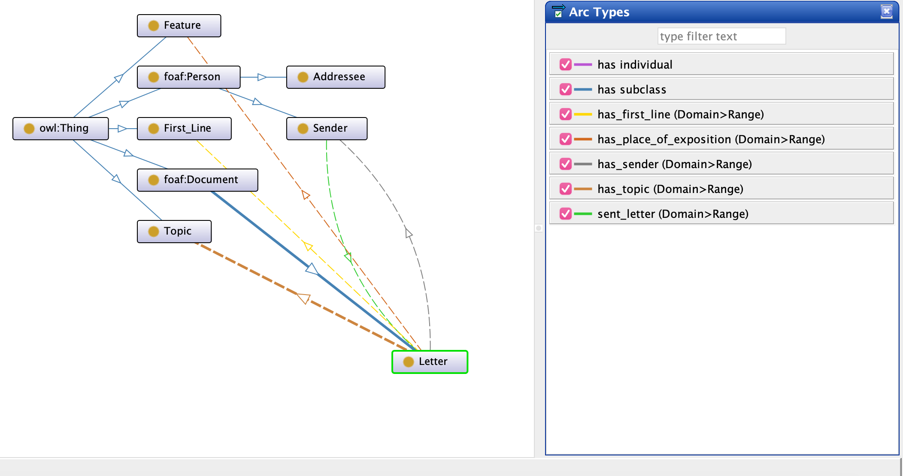
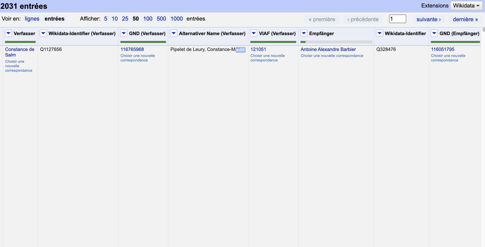
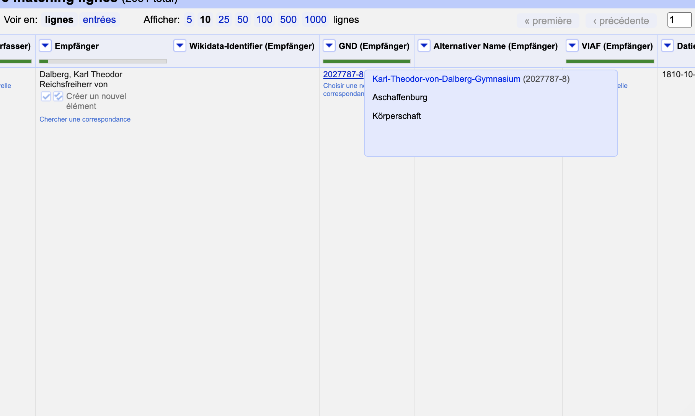
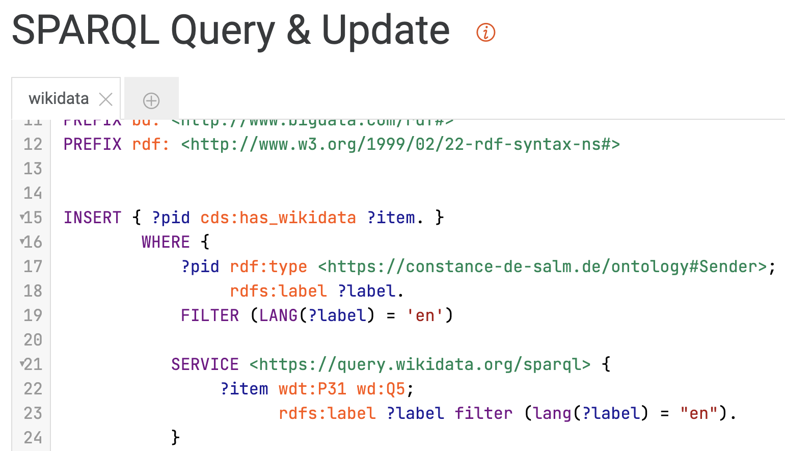
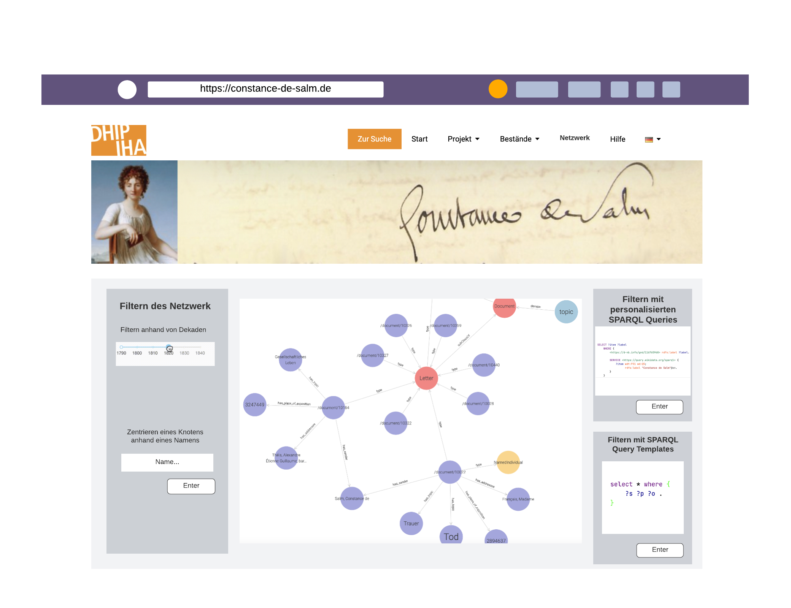

# Visualising the CirCONSTANCEs – Repository of Code and Data Created During My Internship at the IHA/DHI Paris
## Introduction
This repository is a collection of all scripts used for (pre-)processing and visualising the data from the
Constance de Salm correspondence. It also includes the original data (CSV and Excel files) plus result visualisations as demonstrative PNG or GIFs.
 
For more about the history and goal of the Constance de Salm correspondence, please visit the following link: [Die Korrespondenz der
Constance de Salm (1767-1845)](https://constance-de-salm.de/). All required modules and brief descriptions of the scripts can be found
in the [FILE OVERVIEW](./code/FILE_OVERVIEW.md).
## Preprocessing
General preprocessing steps that I had to apply were the transformation of Excel files into CSV to make them more
accessible (open format vs. proprietary format) as well as merging the existing spreadsheets from new incoming data from the FuD
and previously created files from former interns that worked on the correspondence
(see [filtering_and_visualisation.py](./code/filtering_and_visualisation.py) and 
[merge_spreadsheets.ipynb](./code/merge_spreadsheets.ipynb)). Moreover, I filtered the data
according to some specifications based on some ideas that Mareike König gave me.
These include, for example, that only the letters of the author Constance de Salm are considered.
I also extracted and added the year and decade of each letter to the table.
  
For some visualisation and other exports, further preprocessing was necessary (for example a unification of names). This, I
did in the scripts of the corresponding task.

## Histograms of Correspondence Frequencies
Some visualisations that are included are histograms of correspondences throughout the decades. In lieu
of visualising them in Python, further steps were taken in Excel for better team-intern accessibility, readability
and reusability. The script mainly provides tools for [filtering](#preprocessing) the data basis for Excel.  

This is a first try of visualising the correspondence frequencies (y-axis) throughout the decades (x-axis)
using [matplotlib](https://matplotlib.org/). Given the fact that the visualisation did not quite fit
the initial expectations plus the rather complicate handling, I decided to only use Python in this step to retrieve
the filtered data from the CSV and import it into Excel.  

As can be seen in this visualisation, in Excel, I was able to filter the frequencies not only by decades but also by
the people with whom Constance de Salm corresponded. The visualisation is interactive due to Excel's integrated filtering tool
and can be read modified even without further technological expertise.
## Network of Constance de Salm's Correspondence
Firstly, I wanted to create a network that allows a user to interact with it and that has filters that can be modified
and applied to the data. Pre-existing tool like Gephi or Cytoscape both do not include filtering techniques for graph data
so instead I chose to use a Python and Javascript framework to create a virtual server on which a HTML page is launched
that can be used by other people to explore the graph data.
The interactive network was created using the modules [Networkx](https://networkx.org/), [Plotly](https://plotly.com/python/) and [Dash](https://dash.plotly.com/).
Moreover, the script was inspired by the following Medium [article](https://towardsdatascience.com/python-interactive-network-visualization-using-networkx-plotly-and-dash-e44749161ed7)
and adjusted to my needs.  
 
Further information will be added following the example of Semantic Web graphs.
## Enriching the Network with Semantic Information
To visualise a correspondence – an already existing corpus of connections between people who communicated with each other –
in an ontology, can come with many advantages. Not only do Linked (Open) Data standards like RDF make data more [findable, accessible, interoperable
and reusable](https://www.go-fair.org/fair-principles/); they can also bring it into a new context. 

>This is how the RDF model triples the power of any given data piece by giving it the means
to enter endless relationships with other data pieces and become the building block of 
greater, more flexible and richly interconnected data structures.   
> [See: Ontotext – What is RDF?](https://www.ontotext.com/knowledgehub/fundamentals/what-is-rdf/)

Thereby, pre-existing statements, for example those about exchanged
letters of Constance de Salm, can be perceived from a new perspective. More information about people, their relationships,
the places of expositions or the keywords used in the letters can be added.

> Being a powerful and expressive framework for representing data, RDF is used for building knowledge graphs –
> richly interlinked, interoperable and flexible information structures.  
> [See: Ontotext – The RDF Knowledge Graph](https://www.ontotext.com/knowledgehub/fundamentals/what-is-rdf/)

### *First steps – Ontologies and Knowledge Graphs*
The first step of transforming this data basis into an ontology and then a knowledge graph is to find and/or create a model
that fits the data and represents the wanted information.  
In the Semantic Web, one of the main goals is the enrichment of data collections with "richer" information, meaning to enhance its expressiveness. Semantics or ``knowledge`` make such 
bases not only more accessible to humans but also more interoperable on the web.
> The Semantic Web is an extension of the current Web that will allow you to find, share, and combine information more easily.  
> [See: W3C – Goals / Objectives](https://www.w3.org/2003/Talks/0522-swa-em/slide3-0.html)

Thinking of a model can be hard: What do I want my model to express?  
Hence, it can be useful to model some examples by hand, like I did in the following screenshot:

Here, I tried to model what I want the CdS ontology to look like. Implementing a simple, basic model in [Lucidchart](https://www.lucidchart.com/) provided me with a first idea of
what statements might be in the graph and what datatypes could be necessary. An ontology, other than a knowledge graph,
models more abstractly, setting relationships between classes, domains and ranges of properties or datatype rules.
> More
specifically, in ontology, we have categories, properties and relationships
between the concepts, data and entities. Similarly, in Knowledge Graphs, we
have subgraphs, properties, relationships, data and vertices (nodes). However,
there is a fundamental dierence between them. A Knowledge Graph is a
representation of knowledge in a graph form, which very often derives from a
graph database (GDB) - a database that stores data by using a graph
architecture. A Knowledge Graph and its database structure are focused on the
applications we target to build. Therefore, they are defined by the task. On the
other hand, ontology is defined from the domain knowledge, contains the
definition of a concept and its relationships for a given domain as well as the
domain rules.  
> [See: What is the difference between ontology and a Knowledge Graph?](https://tinyurl.com/2p9dvdx3)

## Putting the Theoretical Blah-Blah to Practice
Many methods exist that aid to go from tabular data to RDF representation. For example, Ontotext provides the 
[OntoRefine](https://www.ontotext.com/blog/tabular-data-rdf-graphdb/) tool
with which users can perform the *not so inspiring task of cleaning 
[their\] data and further transforming it into RDF* (cited from the page linked beforehand).
Moreover, the Python package [owlready2](https://owlready2.readthedocs.io/en/v0.37/) provides a toolkit for
creating an ontology and adding instances dynamically, using basic concepts of Python's object-orientation.
Last but not least, [Protégé](https://protege.stanford.edu/) is another free, open-source tool for creating and editing
ontologies.  

### *The notorious pipeline*
As I am still a noob in terms of the Semantic Web and only found out about OntoRefine AFTER I have done the wonderful
task of cleaning the data with Python and [Pandas](https://pandas.pydata.org/), my work-pipeline might
come off as a bit random and wonky at times.  
However, I see this 'project' as a *petit essai* of finding what tools work well and how easily usable they are on relatively
unstructured and uncleaned data, going through the tides of a simulated artificial neural network with occasional backpropagation.

#### Python and Protégé
In Python, using owlready2, I first cleaned and preprocessed the data as already described in [the corresponding section](#preprocessing).
Other than filtering the data, I also had to make some changes regarding the unification of URLs and names of people in the
correspondence. This is further explained in [this section](#handling-the-data--enrichment-with-openrefine). At first, I created the ontology baseline in Protégé: I created classes, data and functional properties
and added the required datatypes. An outline can be found in the following image.

I used a mixture of vocabulary that already exists (of course, RDF, RDF Schema and OWL, as well as [FOAF](http://xmlns.com/foaf/0.1/), [DBO](https://www.dbpedia.org/about/)
and [Geonames](https://www.geonames.org/ontology/documentation.html)) for the classes and properties.
Secondly, I imported the ontology into owlready2 and added the instances of 
the different classes to it.  
These were the first tries of modelling all information in an ontology slash knowledge graph in Protégé.

As the screenshot shows, Protégé is not the best choice for visualising huge knowledge graphs. Instead,
I exported the file serialised in XML/RDF and uploaded it in a GraphDB repository.
More about this in [the section about GraphDB](#3-graphdb-my-beloved-3).

#### Little Digression: OntoRefine
I only found [OntoRefine](https://graphdb.ontotext.com/documentation/9.8/free/loading-data-using-ontorefine.html) after I have already done most of the cleaning and modeling processes with Python
but wanted to find out more about it anyhow. The screenshot below shows that OntoRefine works just like
[OpenRefine](https://openrefine.org/) and takes tabular data as input. It runs on a server in the browser, the data will be loaded there and
users can then analyse, create, change or clean the data. It is also possible to connect the project in OntoRefine
to a Wikibase. Statements in RDF can be directly driven from the data in the columns of the tabular data input.

### *<3 GraphDB my Beloved <3*

#### Handling the Data – Enrichment with OpenRefine
Given the state of the data, with names that are in different languages, some people who lack identifiers (GND, VIAF or the like)
and other similar problems, creating a knowledge graph was not as simple as I previously estimated. So, instead of doing most 
of the enrichment and cleaning via Python and GraphDB, I was advised to take a short dip into OpenRefine
to get a cleaner data basis. This is an inevitable step to be able to retrieve data from extern collections of data – so, 
to do reconciliation – and add it to the existing ontology.

By using the methods offered by OpenRefine, I could both reconcile further knowledge about the people in the correspondence
and do a unification of the names that were already given. 

* What were the problems that led me to this solution?
  * The names were given in different languages and could therefore not be found under the same language label on Wikidata
  * Some names had additional information added to them in parentheses, this led to the same problem as mentioned above
* Why is this useful?
  * Names can be unified in multiple columns at the same time
  * Reconciliation can be done using more than just one service at a time, e.g. Wikidata, GND or VIAF
  * Errors that remained hidden can be uncovered: Even if most of the processes are supposed to be automated, unfortunately, a manual postcorrection is inevitable. With further reconciled information, I could not only unify names but also detect some identifiers that were not correctly chosen. For example, for one person, the GND entry of a highschool was given instead of the correct link to the person.

* And now?
  * Now that the data basis provides (a little more) uniformity AND some enriched data, it can be exported and added into GraphDB one again
#### An Alternative: Adding Statements Using SPARQL
Alternatively, if the data is already in a relatively unified state, adding statements and reconciliating
information could also be done by using SPARQL queries (in GraphDB). This is also what I first tried to do, searching for 
the names that are given in the correspondence as labels in Wikidata and thereby getting additional information for the graph.
This worked for only those whose name was exactly the same as the label provided by Wikidata and ONLY if the language tag also corresponded
to the language in which the label is given – stuff that researchers would have to look up manually and which renders the automation
of this process almost superfluous.

Nevertheless, I tried adding the statements about Constance de Salm given by Wikidata to my knowledge graph. The SPARQL Query & Update
tab in GraphDB makes this extremely easy and comprehensible. 
#### Export and Visualisation of Graphs
In GraphDB, graphs / ontologies can be easily visualised and interacted with within the server. 

But why was all the preprocessing worth it?
Additional data can be reconciled from extern resources AND multiple names can be used for doing so because
the property "alias" now can be used as a look-up table if a label could not be found in an extern database. However,
some people in the correspondence are still not identified – meaning they only have an ontology-specific identifier. As already mentioned 
in the previous section, this underlines the necessity of manual postcorrection.  
Nevertheless, by using SPARQL (as described in [this section](#an-alternative-adding-statements-using-sparql)) in GraphDB,
statements can now be added via querying. 
This already shows a feature I would like to add later on:
Using SPARQL to query information that is not explicitly given in the graph YET.
#### Interactive Visualisation of Knowledge Graphs
The ultimate goal of this little project is to create a website on which users can access the network of the correspondence
and filter it using either SPARQL queries or other tools (decade slider or text input). An exemplary view
of the application on the website can be seen in the following image.

However, since the time of my internship did not suffice to complete it, this step will stay incomplete until further notice.
